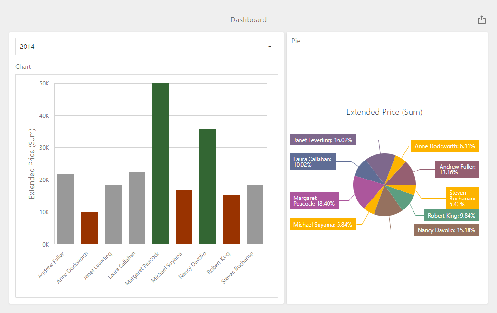

<!-- default badges list -->

<!-- default badges end -->
# Dashboard for ASP.NET Core - How to Color the Dashboard Item's Elements on the Client

The following example shows how to color a dashboard item's elements on the client. To do this, handle the [ViewerApiExtensionOptions.onItemElementCustomColor](https://docs.devexpress.com/Dashboard/js-DevExpress.Dashboard.ViewerApiExtensionOptions?p=netframework#js_devexpress_dashboard_viewerapiextensionoptions_onitemelementcustomcolor) event, get the item's [multidimensional data](https://docs.devexpress.com/Dashboard/403003/web-dashboard/dashboard-control-for-javascript-applications-jquery-knockout-etc/obtain-underlying-and-displayed-data#client-data-structure), and apply the color to the dashboard item's element based on the condition.

The image below displays dashboard items whose values are colored based on their values:

- [Chart item](https://docs.devexpress.com/Dashboard/117159/web-dashboard/create-dashboards-on-the-web/dashboard-item-settings/chart): For 2014, values that exceed 30k are colored green, values below 17k are red, and values between 170k and 30k are gray.
- [Pie item](https://docs.devexpress.com/Dashboard/117162/web-dashboard/create-dashboards-on-the-web/dashboard-item-settings/pies): Values below 80k are colored yellow.

## Files to Look At

* [elementCustomColor.js](./CS/AspNetCoreDashboardColoring/wwwroot/js/elementCustomColor.js)
* [Index.cshtml](./CS/AspNetCoreDashboardColoring/Pages/Index.cshtml)

## Documentation

- [Coloring Basics](https://docs.devexpress.com/Dashboard/116915)
- [Coloring in the Web Dashboard](https://docs.devexpress.com/Dashboard/117152)

## More Examples

- [Dashboard for ASP.NET Core - How to Customize the Color Palette](https://github.com/DevExpress-Examples/asp-net-core-dashboard-customize-color-palettes)
- [Dashboard for Web Forms - How to Color the Dashboard Item's Elements on the Client](https://github.com/DevExpress-Examples/web-forms-dashboard-color-dashboard-item-elements)
